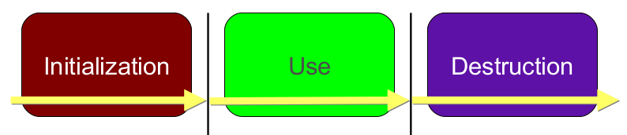
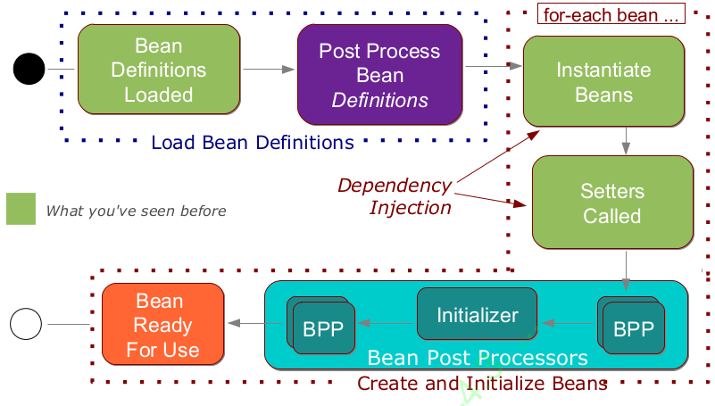
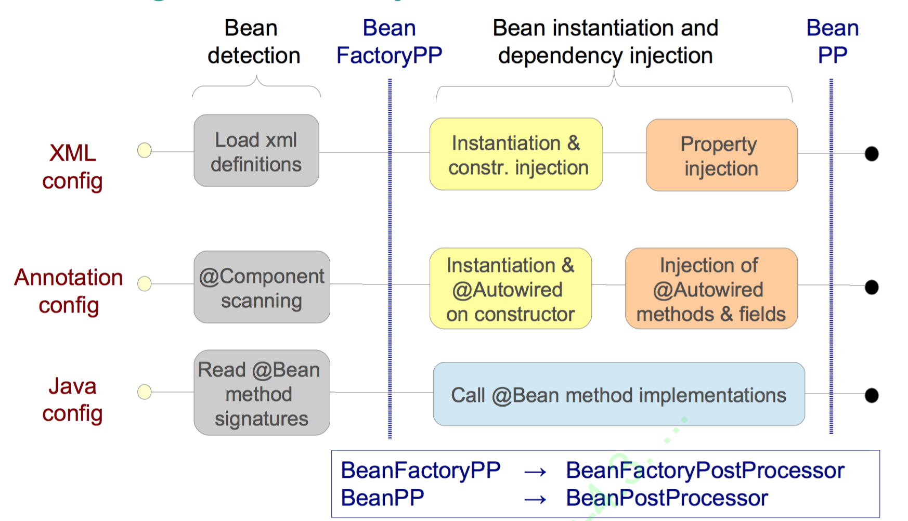
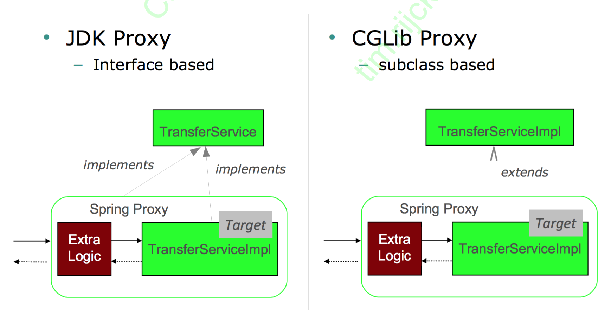

#Spring 4.3

These are just my personal notes I took during the 4 day [SpringSource Core Spring](http://www.oak3.be/course/springsource-core-spring-0) training.  
Reflective notes.

Some important concepts of Spring Framework

* Focus on POJO's that have a *Single Purpose*
* Program to interfaces
* Testable code
* Low Coupling
* High Cohesion

Take a look at the mock exams or use the 
[interactive quiz online](https://www.goconqr.com/en/p/4316687-core-spring-4-2-certification-mock-exam-quizzes) 
to test your knowledge.

##Spring Configuration

* Java Configuration classes
* XML Configuration
* Annotations

###Java Configuration Class

Functions should be declared `public`.  
Each bean is given a unique id / name.
Bean ids should not contain implementation detail.

```kotlin
@Configuration
open class RewardsConfig {

    @Autowired lateinit var dataSource: DataSource

    @Bean
    open fun rewardNetworkImpl(accountRepository: JdbcAccountRepository,
                          restaurantRepository: JdbcRestaurantRepository,
                          rewardRepository: JdbcRewardRepository) =
            RewardNetworkImpl(
                    accountRepository,
                    restaurantRepository,
                    rewardRepository
            )

    @Bean
    open fun accountRepository() = JdbcAccountRepository().apply { setDataSource(dataSource) }

    @Bean
    open fun restaurantRepository() = JdbcRestaurantRepository().apply { setDataSource(dataSource) }

    @Bean
    open fun rewardRepository() = JdbcRewardRepository().apply { setDataSource(dataSource) }
}
```

###Disambiguation
Beware of duplicate bean definitions.   
It is *not* illegal to define the same bean more than once. You will just get the last bean Spring 
sees defined.
  
To prevent this behavior look at `@Qualifier`

```java
@Component("transferService")
public class TransferServiceImpl implements TransferService {
    @Autowired
    public TransferServiceImpl(@Qualifier("jdbcAccountRepository")
                                       AccountRepository accountRepository) { ...}
}

@Component("jdbcAccountRepository")
public class JdbcAccountRepository implements AccountRepository {..}

@Component("jpaAccountRepository")
public class JpaAccountRepository implements AccountRepository {..}
```

###Bean Resolution

The way Spring finds the correct bean is in following order

1. Look for unique bean of required type
2. Use `@Qualifier` if supplied
3. Try to find a mathing bean by name

>3. Is is very much a fallback so you should avoid using this convention and make it more explicit

####Explicit vs Implicit Bean Definition (Annotation Driven)

Above is an example of an explicit bean definition file. Namely you provide all the beans in a configuration.  
Implicit `autoMagically` tries and search for your `Components`

Implicit Configuration
```java
@Component
public class TransferServiceImpl implements TransferService {
    @Autowired
    public TransferServiceImpl(AccountRepository repo) {
        this.accountRepository = repo;
    }
}
```

```java
@Configuration
@ComponentScan("com.bank")
public class AnnotationConfig {
    // No bean definition needed any more
}
```

`@ComponentScan` searches for your beans in a particular package.

####Java Configuration vs Annotations

#####Java Configuration

| Pro's                                                 | Cons         
| ----------------------------------------------        |:-------------:
| Is centralized in one (or a few places)               | More Verbose than annotations
| Write any Java code you need                          | 
| Strong type checking enforced by compiler (and IDE)   | 
| Can be used for all classes (not just your own        | 

#####Annotations

| Pro's                                   | Cons         
| ----------------------------------------|:-------------:
| Single place to edit (just the class)   | Configuration spread across your code base 
| Allows for very rapid development       | Only works for your own written code
|                                         | Merges configuration and code (bad sep. of concerns)

Best pratice is to use annotations as much as possible.

In real life you will see these two being mixed.  
Beans that are maintained by the company will be annotated and legacy code or code from dependencies
will live in a Java configuration file.   
 
One example where a Java configuration would be preferred is for a `Datasource` that you need to 
configure with different parameters

####Descriptors

You can define descriptors on the bean definitions.  
With the `@Descriptor` annotation  
This is comparable to a `Javadoc` for a bean.

####Imports

Organize your `@Configuration` classes however you like.  
Best practive: seperate out `application` beans from `infrastructure` beans.    
You can `import` other configuration files with `@import` on top of the class declaration.

```kotlin
@Configuration
@Import(TestInfrastructureConfig::class)
open class RewardsConfig { ... }
```

####Start the context

Start the `ApplicationContext`

Spring Boot:

```kotlin
val context: ApplicationContext = SpringApplication.run(RewardsConfig::class.java)
```

Using XML:

```java
SpringApplication.run(MainConfig.class);
```

```java
@Configuration
@ImportResource( {
        "classpath:com/acme/application-config.xml",
        "file:C:/Users/alex/application-config.xml" } )
@Import(DatabaseConfig.class)
public class MainConfig {}
```
Valid prefixes are:
* classpath (default)
* file
* http
 
>Multiple files are possible
>Able to combine with `@Configuration` annotations 

Some other (older) ways to load the Context

```java
// Load Java Configuration class
new AnnotationConfigApplicationContext(MainConfig.class);
// Load from $CLASSPATH/com/acme/application-config.xml
new ClassPathXmlApplicationContext(“com/acme/application-config.xml”);
// Load from absolute path: C:/Users/alex/application-config.xml
new FileSystemXmlApplicationContext(“C:/Users/alex/application-config.xml”);
// Load from path relative to the JVM working directory
new FileSystemXmlApplicationContext(“./application-config.xml”);
```

####Get beans from context

Get beans directly from the context
There are three ways:

- Classic way: cast is needed

```kotlin
val transferService = context.getBean("transferService") as TransferService
```

- Use typed method to avoid cast

```kotlin
val transferService = context.getBean("transferService", TransferService::class.java)
```

- No need for bean id if type is unique

```kotlin
val rewardNetwork = rewardNetwork = context.getBean(RewardNetwork::class.java)
```

####Bean Scope
A scope defines how your beans are defined.  
Examples of scopes are:  
- singleton
- prototype
- session (new instance created per user session) 
- request (new instance per request)

Custom scopes are allowed, but are rarely used.

#####Singleton
Default a bean is scoped as a `singleton`.

```kotlin
@Bean 
fun accountService() : AccountService = AccountService() 

//Equivalent

@Bean
@Scope("singleton")
fun accountService() : AccountService = AccountService()
```

#####Prototype
A new instance is created every time bean is referenced

```kotlin
@Bean 
@Scope("prototype")
fun accountService() : AccountService = AccountService() 
```

### XML Configuration

Old way of configuring your beans.  
Spring pushes java configuration instead of XML.

Example of a XML Configuration 


```xml
<beans profile=“prod”>
    <bean id=“transferService” class=“com.acme.TransferServiceImpl”>
        <property name=“repository” ref=“accountRepository” />
    </bean>
    <bean id=“accountRepository” class=“com.acme.JdbcAccountRepository”>
    </bean>
</beans>
```

You should now only be able to understand how you would apply the same principles as with Java
Configuration for the XML configuration. 

####FactoryBean Interface

Is a fallback for complex configuration in XML.  
implementing `FactoryBean<T>` interface allows you to have the factory pattern in place for XML
configurations.

>Even Java Configuration may use factory beans  

They are widely used in older frameworks  
Some well known examples are:

* EmbeddedDatabaseFactoryBean
* JndiObjectFactoryBean
* Creating remote proxies
* Creating caching proxies
* For configuring data access technologies

####Namespaces

Namespaces allow hiding of actual bean definitions you may want to add.  
They can greatly reduce the XML configuration file.  

```xml
<context:property-placeholder location="db-config.properties" /> <!-- Hides 1 bean definition -->
<aop:aspectj-autoproxy /> <!-- Hides 5 bean definitions -->
<tx:annotation-driven /> <!-- Hides more than 15 bean definitions -->
```

>Common practice do not use a versioned `*.xsd` file. Always go for the un-versioned. This will
allow you to always be on the latest version. And makes sure you have an easier migration.

Some examples are:

* aop (aspect oriented programming)
* tx (transactions)
* util
* jms
* context

##Property Values

Externalize your properties.  
It allows for a more readable and flexible way of configuring your Spring application.

###Environment

Get environmental variables from the runtime environment  
*Environment Variables* and *Java System Properties* are always populated automatically

```kotlin
@Bean
fun dataSource(): DataSource {
    val ds = BasicDataSource()
    ds.setDriverClassName(env.getProperty(DB_DRIVER))
    ds.setUrl(env.getProperty(DB_URL))
    ds.setUser(env.getProperty(DB_USER))
    ds.setPassword(env.getProperty(DB_PWD))
    return ds
}
```

Environment obtains values from *property sources*  
`@PropertySource` contributes additional properties

```kotlin
@Configuration
@PropertySource("classpath:/com/organization/config/app.properties")
@PropertySource("file:config/local.properties")
class ApplicationConfig {
    
    @Bean
    fun dataSource(
        @Value("${db.driver}") driver : String, 
        @Value("${db.url}")  url : String, 
        @Value("${db.user}") user : String, 
        @Value("${db.password}") password : String) {
    }
}
```

>How are these `${ ... }` evaluated?

They need a dedicated bean: `PropertySourcesPlaceholderConfigurer`    
**NOTE** A static bean otherwise this still won't work

```java
@Bean
public static PropertySourcesPlaceholderConfigurer pspc() {
    return new PropertySourcesPlaceholderConfigurer();
}
```

###Profiles
Beans can be grouped according to for example their environment they live in.  
>Beans without a profile will always be available / loaded

They way you define them is with the `@Profile` annotation.  
You can either place them on a class or a method header.  
This way you can split up your configuration file for each environment.

```kotlin
@Configuration
@Profile("dev")
class DevConfig
```

or 

```kotlin
@Bean(name="dataSource")
@Profile("dev")
@PropertySource("dev.properties") 
fun dataSrouceForDev() : DataSource
```

>`@Profile` can control which `@PropertySources` are included in the Environment

How do you active these profiles at run-time?

```bash
-Dspring.profiles.active=dev,jpa       #dev profile and jpa profile are active now. 
```

Or pragmatically

```java
System.setProperty("spring.profiles.active", "dev, jpa");
SpringApplication.run(AppConfig.class);
```

Under tests (and only then) you can use the `@ActiveProfiles`

```kotlin
@ActiveProfiles("dev, jpa")
class Test
```

##SPEL 

Short for Spring Expression Language  
Allows you to inject some logic in a `String` value

```java
@Configuration
class TaxConfig
{
    @Value("#{ systemProperties['user.region'] }") String region;
    @Bean public TaxCalculator taxCalculator1() {
        return new TaxCalculator( region );
    }
    
    @Bean public TaxCalculator taxCalculator2
        (@Value("#{ systemProperties['user.region'] }") String region, ...) {
    return new TaxCalculator( region );
    }
}
```

Equivalent way of getting to properties so:

```java
@Value("${daily.limit}")
int maxTransfersPerDay;
```

is the same as in **SPEL**

```java
@Value("#{environment['daily.limit']}")
int maxTransfersPerDay;
```

However you don't need to define the `PropertySourcesPlaceholderConfigurer` bean.
  
Properties returned by this always return a  `Sring`.  
Sometimes you therefore have to cast it if you want to do some calculations on it.  

```java
@Value("#{new Integer(environment['daily.limit']) * 2}")
@Value("#{new java.net.URL(environment['home.page']).host}")
```

Attributes **SPEL** can retrieve include:
* Spring Beans
* Implicit references
    * Spring Environment
    * System Properties
    * System Environments
    * Others depending on context
    
##Annotations in Spring

###@Autowired

Autowired can be used to inject 
* Constructors
* Methods with arguments
* Setters
* Fields 

> The `fields` can even be `private`, but it makes it harder to test  

> Since Spring follows the standards for DI you can also use `@Inject`

Default `@Autowired` dependencies are required.  
Override this default behavior when you want

```java
public void setAccountRepository(AccountRepository a) {
    this.accountRepository = a;
}
```

####Setter- vs Constructor Injection

| Constructors                                  | Setters           
| ----------------------------------------------|:-------------:
| Mandatory Dependencies                        | Optional / Changeable dependencies 
| Immutable Dependencies                        | Circular dependencies      
| Concise (pass several params at once)         | Inherited Automatically
|                                               | If constructor needs too many parameters

As a general rule thought just follow your teams convention.

###@Value

Value can be used to inject
* Constructors
* Methods with arguments
* Fields

####Default Value

If `@Value` is resolved and returns *null* you can provide a default value.

```java
@Autowired
public TransferServiceImpl(@Value("${daily.limit : 100000}") int max) {
    this.maxTransfersPerDay = max;
}
```

For **SPEL** you use the *Elvis Operator* 

```java
@Autowired
public setLimit(@Value("#{environment['daily.limit'] ?: 100000}") int max) {
    this.maxTransfersPerDay = max;
}
```

###@ComponentScan

Components are scanned at startup  
>Note that dependencies are also scanned. Therefor you should always define a `basePackage` as this
may drastically improve startup time.

```java
@ComponentScan ({"com.bank.app.repository", "com.bank.app.service", "com.bank.app.controller"})
```

###@PostConstruct & @PreDestroy

####@PostConstruct 

Method called at startup after dependency has done all its injections.  
So after constructors and setter injections
>Will only work when `@ComponentScan` is defined in the configuration file.

Can take any visibility, but must take no parameters and only return *void*

####@PreDestroy

Method called at shutdown prior to destroying the bean instance.  
Called when a `ConfigurableApplicationContext` is closed.

> If *application* (JVM) exits normally
 
Note that this is not the destruction of the object itself as we know it in Java.
>Will only work when `@ComponentScan` is defined in the configuration file.

```java
public class JdbcAccountRepository {
    @PreDestroy
    public void clearCache() { ... }
}
```

You can expliticly let this callback be called
 
```java
ConfigurableApplicationContext context = SpringApplication.run(...);
context.close();
```

Can take any visibility, but must take no parameters and only return *void*

####Java Config way

```java
@Bean (initMethod="populateCache", destroyMethod="clearCache")
public AccountRepository accountRepository() {
    // ...
}
```

###Stereotype Annotations

Stereotype annotations are *syntactic sugar* for `@Component`  
They inherit from `@Component` so when you apply the `@ComponentScan ( "..." )` Spring finds them.

Examples of predefined stereotype annotations are:

* Service
* Repository
* Controller
* Configuration

>Other Spring projects may add in their own stereotype annotations.

###@Resource

Identifies dependencies by *name* not by *type*.  
The difference with `@Autowired` is that it will first check by *name* before *type*

Setter injection

```java
@Resource(name="jdbcAccountRepository”)
public void setAccountRepository(AccountRepository repo) {
    this.accountRepository = repo;
}
```

Field injection

```java
@Resource(name="jdbcAccountRepository”)
private AccountRepository accountRepository;
```

##Bean Lifecycle

Spring fits in to manage your application lifecycle. It may play an important role in all phases.  
The lifecycle only applies to any class of *application*

* Standalone Java or Spring Boot application
* Integration/System Test
* Java EE



###Initialization

* Prepares for use 
* Application services
    * are created
    * configured
    * may allocate system resources
* Application is not usable until this phase has completed



####Load Bean Definitions
 * The `@Configuration` classes are processed and `@Components` are scanned and or XML files are
 parsed
 * Bean definitions get added to the *BeanFactory*
 * Special *BeanFactoryPostProcessor* beans invoked
 
After that each bean is instantiated. Created in the correct order.  
Next each bean goes through a post-processing phase `BeanPostProcessors`  
Now the bean is fully initialized and ready to be use
 
####BeanFactoryPostProcessor

Applies transformations to bean definitions (so before the object are created)  
Some use cases involve reading properties and registering custom scopes.  
For example the [`PropertySourcesPlaceholderConfigurer`](#Environment)  
You can write your own, but it is very uncommon. You do this by implementing the
`BeanFactoryPostProcessor` interface

####Initializer Extension Point

A special case of BeanPostProcessor.  
It causes the `@PostConstruct` to be called.  
The way this works is by using a BPP for example the `CommonAnnotationBeanPostProcessor` enables
this functionality

####BeanPostProcessors Extension Point 

Important extension point in Spring. This allows it to modify bean instance in any way.  
In order to use this functionality the user must implement the `BeanPostProcessor` interface.  
They will automatically be picked up by the Spring Framework.

####Configuration Lifecycle



###Use

When you invoke a bean obtained from the context.  
Spring can add functionality to your requested object this is why the `proxy pattern` has been 
implemented on your Spring beans. This happened during the initialization phase of the lifecycle.

Spring uses either the build in `proxy` classes available in the `JDK` or use a library called
`CGLIB` to do more advanced proxy-ing.



* Used by clients
* Application services
    * Process client requests
    * Carry out application behaviors
* 99.9% of time is spent in this phase

| JDK Proxy                             | CGLib Proxy           
|---------------------------------------|:---------------------------------------------:
| Also called *dynamic* proxies         | **NOT** built into JDK 
| API is built into the JDK             | Included in Spring jars      
| Requirements: Java Interface(s)       | Used when interfaces not available
| *All* interfaces proxied              | Cannot be applied to final classes or methods

###Destruction

When you close a context the destruction phase completes.

It destroys beans instances if instructed and calls their clean-up methods. Beans must have a
destroy method defined (a no-arg method returning void)

After the context is destroyed it can not be used again. 

* Shuts down
* Application services
    * release any system resources
    * are eligible for GC

##Testing Spring

###Unit testing 

Basic `JUnit4` tests

###Integration testing

Tests the interaction of multiple units working together.  
Central support class is called `SpringJUnit4ClassRunner` since Spring 4.3 they added a shorten name
class called: `SpringRunner`.   
This class allows you to share an `ApplicationContext`

####Databases

It is very common to test databases in integration tests.  
You can use an in memory database for this.  
>Not always a good fit since you want to keep your tests as close as possible to the real environment.

Common requirement is to populate the DB before every test run.   
We can use the `@Sql` annotation for this.

```java
@Sql(scripts = "/test-user-data.sql",
     executionPhase = ExecutionPhase.AFTER_TEST_METHOD,
     config = @SqlConfig(
             errorMode = ErrorMode.FAIL_ON_ERROR, 
             commentPrefix = "//", separator = "@@"
             )
     )
@Test
fun testFunctionName() { }
```

##AOP

Aspect Oriented Programming.  
Generic functionality that is needed in many places in your application.  

When you want to implement a feature and you describe this feature as following:

>Perform a role-based security check before **EVERY** application method.

It is a clear sign this requirement is a *cross-cutting concern*

Examples:
* Logging and Tracing
* Transactional Management
* Security
* Caching
* Error Handling
* ...

###Limitations

* Can only advise *non-private* methods.
* Can only apply aspects to *Spring Beans*
* Limitations of weaving with proxies
    * consider the following: When using proxies suppose a method `a()` calls method `b()` on the same
    class/interface the advice will never be executed for method `b()`

###How

Spring creates a proxy around your object.  
This new proxy object intercepts all the request to this object. This way you can decide to act upon it.


###AOP Concepts

####Join Point

A point in the execution of a program such as a method call or when an exception is thrown.  
Spring AOP uses AspectJ's pointcut expression language for selecting where to apply advice.  
Spring AOP supports a practical subset

####Pointcut

An expression that selects one or more Join Points

####Advice

Code to be executed at each selected Join Point

####Aspect

A module that encapsulates pointcuts and advice

####Weaving

Technique by which aspects are combined with main code

###Implement the Aspect

Best practice is to keep all aspects inside of a package.  
This way you can have one configuration class that keeps them all together.  
You should annotate the configuration class with yet another annotation `@EnabledAspectJAutoProxy` in order 
for Spring to pick up all your aspects.

```kotlin
@Configuration
@EnableAspectJAutoProxy
@ComponentScan(basePackages=“com.example”)
class AspectConfig 
```

###Writing Expressions


Examples

```java
execution(void send*(String))
```

Any method starting with send that takes a single String parameter and has a void return type.

```java
execution(* send(int, ..))
```

Any method named send whose first parameter is an int (the .. signifies 0 or more parameters may follow)

You can also restrict by class

```java
execution(void example.MessageServiceImpl.*(..))
```

Any void method in hte *MessageServiceImpl* class (including sub-classes)  
Ignored when another implementation is used.

Or by interface

```java
execution(void example.MessageService.send(*))
```

Any void method *send* taking one argument in any object implementing *MessageService*  
More flexible choice - works if implementation changes.

Or even by annotation

```java
execution(@javax.annotation.security.RolesAllowed void send*(..))
```

Any void method whose name starts whit *send* that is annotated with the `@RolesAllowed` annotation.  
Ideal for your own classes.  
This is also how a lot of the build in Spring AOP aspects work like `@Transactional`

Restrict by package

```java
execution(* rewards..restaurant.*.*(..))
```

There may be several directories between rewards and restaurant

```java
execution(* *..restaurant.*.*(..))
```

Any sub-package called restaurant

####Before advice

Using the `@Before` annotation

An example of a logging aspect that monitors all *setter* methods.  

```java
@Aspect
@Component
public class PropertyChangeTracker {
    private Logger logger = Logger.getLogger(getClass());
    @Before("execution(void set*(*))")
    public void trackChange(Joinpoint point) {
        String name = point.getSignature().getName();
        Object newValue = point.getArgs()[0];
        logger.info(name + " about to change to " + newValue + " on " + point.getTarget());
    }
}
```
>With the help of the `JoinPoint` object we get more information.

####AfterReturning Advice

Run after the target has done it's thing

```java
@AfterReturning(value="execution(* service..*.*(..))",
returning="reward")
public void audit(JoinPoint jp, Reward reward) {
    auditService.logEvent(jp.getSignature() +
            "returns the following reward object :" + reward.toString() );
}
```

You get the value *Reward* that was returned by the target.

####AfterThrowing

Only invokes advice if the right exception type is thrown.  
The `@AfterThrowing` advice will **NOT** stop the exception from propagating.  
However you can map it to a different type of exception.

```java
@AfterThrowing(value="execution(* *..Repository.*(..))", throwing="e")
public void report(JoinPoint jp, DataAccessException e) {
    mailService.emailFailure("Exception in repository", jp, e);
}
```

####After

Called regardless of whether an exception has been thrown by the target or not.

####Around

Inherits from `JoinPoint` and adds the `proceed()` method.  
Combination of `@Before` and `@After`


Use the `point.proceed()` on the `ProceedingJoinPoint` object to control the flow of the target.

#This is just here to allow for some easy copying

Current page number: 99

```java

```

```kotlin

```